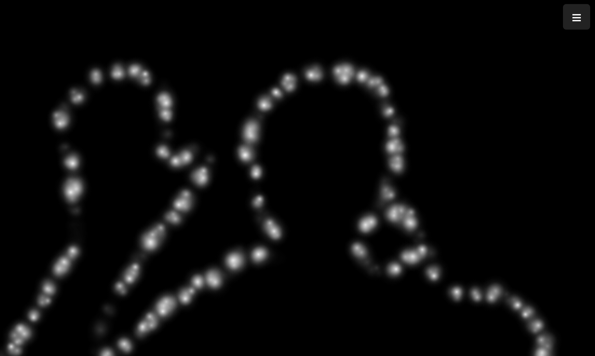

# Implant Simulator

<p align="center">
  
</p>


A web-based visual prosthesis (phosphene) simulator for research, education, and accessibility awareness. Simulates how a person with a visual implant might perceive the world using a live camera feed, AI segmentation, and various visualization modes.


## Features

- Live camera feed
- Multiple visualization modes: normal, background removal, outline, phosphene simulation
- Adjustable grid and dot density
- Simple, responsive interface (works on mobile)


## How It Works

- **Camera**: Uses `getUserMedia` to access your webcam.
- **Segmentation**: MediaPipe Selfie Segmentation (runs in-browser, no server needed).
- **Rendering**: Canvas overlays for outlines and phosphene dots.
- **UI**: Dropdown menu, slider, and grid toggle for easy interaction.

## Getting Started

1. **Clone the repository**
   ```sh
   git clone https://github.com/linusarneng/implant_simulator.git
   cd implant_simulator
   ```
2. **Open `index.html` in your browser**
   - No build step required. All code runs in the browser.
   - For best results, use Chrome or Edge (mobile supported).

## File Structure

```
implant_simulator/
├── index.html         # Main HTML file
├── style.css          # All styles (responsive/mobile)
├── main.js            # App logic (camera, segmentation, UI)
├── docs/              # Screenshots and documentation assets
└── ...
```

## Credits
- [MediaPipe Selfie Segmentation](https://google.github.io/mediapipe/solutions/selfie_segmentation.html)
- [BodyPix (legacy)](https://github.com/tensorflow/tfjs-models/tree/master/body-pix)
- Inspired by real-world visual prosthesis research

## License

MIT License. See [LICENSE](LICENSE) for details.

